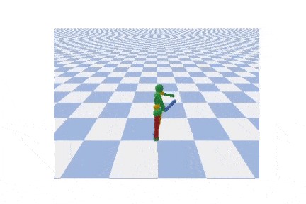

# actor_critic_agents
my re-implementation of actor critic agents. Part of another "learning progress repo" I had but it started to become too messy... For now the focus is on Continuous action spaces, and actor_critic agents.

The generated results will be from the Google Colab (JupyterNotebook) version, since computational resources is limited at hand.

## Soft-Actor-Critic

### Preliminary result:

Trying to reproduce the result of the paper on **PyBullet_Mujoco**, with original hyper parameters. 

Preliminary Result(Running 1 Million iteration, 10% of the original paper):

##Requires 
With movement to Google Colab, we had to give up Mujoco as part of the environment (since one can't use Mujoco on Google Colab without tedious steps), and moved to [PyBullet](https://pybullet.org/wordpress/) simulator, with openAI gym API support

* PyTorch (>1.7.0 for additional distributions)
* openAI gym (including pybullet)

### Mujoco-py needs some env variable fixing
On Ubuntu 18.04 (my machine) the following additional envirnoment variable have to be set.
(in.bashrc or manually in terminal)

LD_LIBRARY_PATH=$LD_LIBRARY_PATH:/home/user/.mujoco/mujoco200/bin

export LD_PRELOAD=/usr/lib/x86_64-linux-gnu/libGLEW.so.2.0
